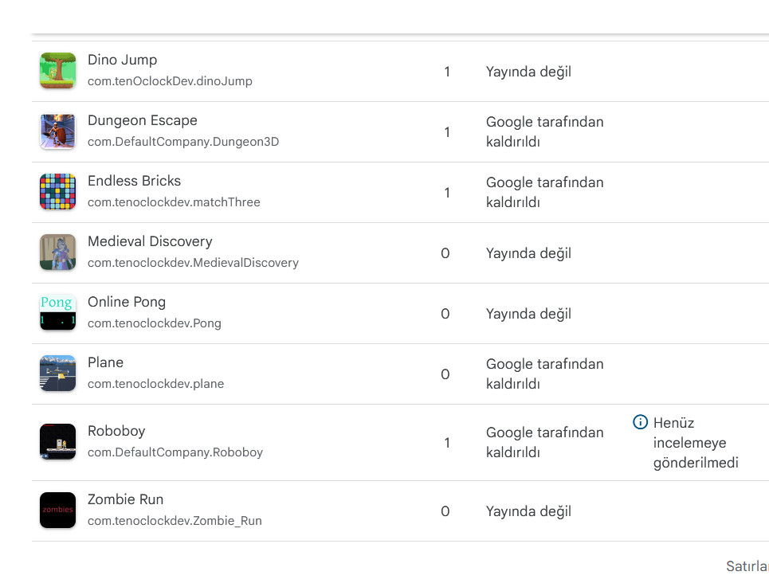

	

		<h3>PDF to excell</h3>
		

			Converting numbers from pdf files to excell sheets and sums
		

		<h6>Techs used</h6>
		

			Python, Excell, PDF libraries.
		

		

		<a href="https://github.com/NecromancerSkeleton/PdfToExcell" class = "icon alt fa-{{ 'github' | downcase }}" target = _blank > github link</a>
		

	

	

		<h3>CaloriCalculator</h3>
		

			Calculates calories for homemade meals
		

		<h6>Techs used</h6>
		

			Kotlin native.
		

	

	<!-- Break -->
	

		<h3>Price comparison project selenium</h3>
		

			Compares prices from different sites and make shopping economic. 
		

		<h6>Techs used</h6>
		

			Selenium, Chrome, Java.
		

	

	

		<h3>Ar project</h3>
		

			Interaction project with speech using Turkish language.
		

		<h6>Techs used</h6>
		

			Vuforia, Unity.
		

	

	

		<h3>html webpage</h3>
		

		Info website about a shop.
		

		<h6>Techs used</h6>
		

			Html, Css.
		

	

	

		<h3>React project</h3>
		

			Order and asign work to machines from mobile devices. Amazon sources used. 
		

		<h6>Techs used</h6>
		

			Amazon Elastic Beanstalk, Mysql, React Native.
		

	

<!--
Roboboy
Dungeon escape
dinojump
flight simulation game
Endless bricks
Zombie Run

Online pong game 
tower defence project
 -->

 <h2 id="content">Games</h2>

	

		<h3>Roboboy</h3>
		
2D platformer game had 36 levels

	

	

		<h3>Dungeon Escape</h3>
		

		3D interactive escape game interacting objects and fighting skeletons
		

	

	<!-- Break -->
	

		<h3>Flight simulation game</h3>
		

		Plane game with tilt controls on mobile phones
		

	

	

		<h3>Endless bricks</h3>
		

			2D match3 game while matching 3 blocks to break and load more ! 
		

	

	

		<h3>Zombie Run</h3>
		

			3D game running from hungry zombies
		

	

	

		<h3>Online pong game</h3>
		

		Very simple yet online game using photon
		

	

	

		<h3>tower defence project</h3>
		

		While in university i created tower defence simulation mob spawn and defending lands !
		

	

	

 
<h2 id="content">3D art</h2>
	
i have created some 3d assets in blender
	
		<ul class="actions">
			<li><a href="https://softwaregame.github.io/artwork" class="button">Art Site</a></li>
			<li><a href="careerAndInterests.html" class="button next">Career and Interests</a></li>
		</ul>

